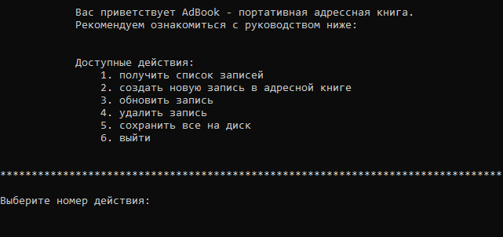

# ADDRESS BOOK

Приложения представляет собой адресную книгу. 
*приложение сугубо консольное, возможно, в будущем будет переведено на
веб-платформу или десктоп*

  <a href="#" target="_blank">
    
     

  </a>

***

## **Устанока:**
***
1. Нужно скопировать репозиторий: *git clone https://github
.com/averlor/address-book.git*
2. Далее установить дополнительную библиотеку: *pip3 install sqlite3*

## **Функционал:**
***

Имеется следующий функционал:

1. Получение всех записей книги
2. Создание новой записи
3. Обновление конкретной записи
4. Удаление конкретной записи
5. Сохранение всех изменений книги

## **В будущем:**
***

Планируется добавить *поиск по имени*

### **Техническим специалистам**
***

